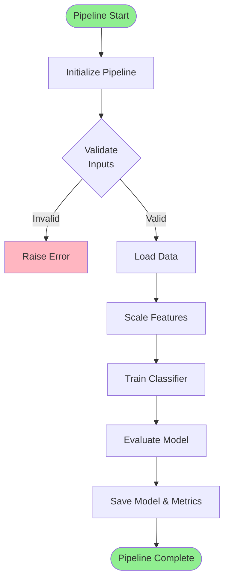
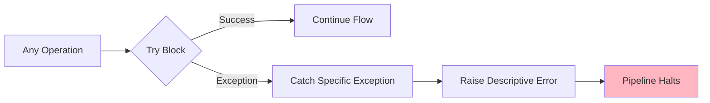
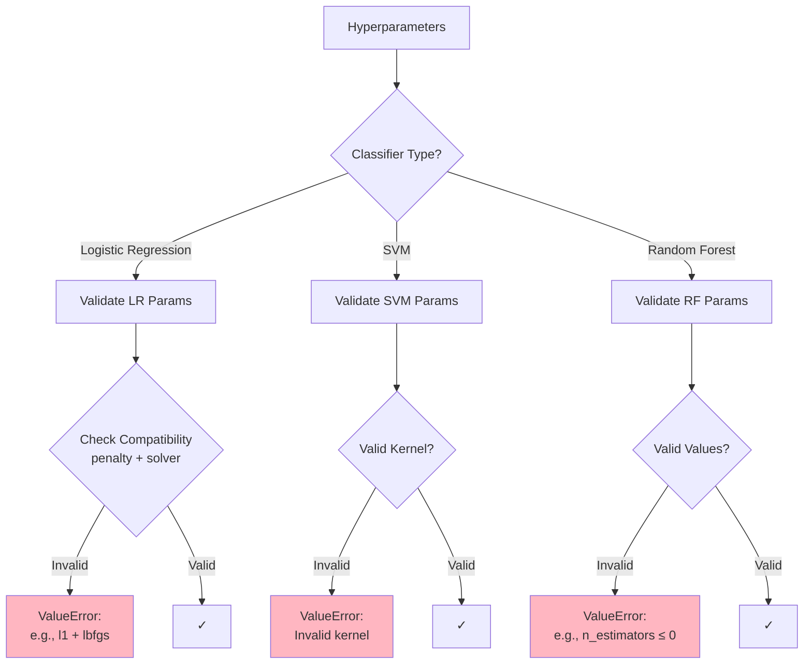
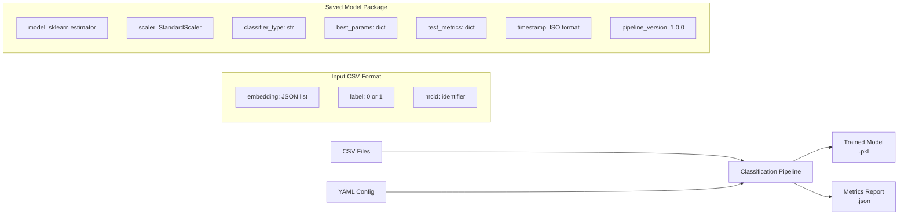

# Binary Classification Pipeline Architecture

## Overview
This document provides a visual representation of the binary classification pipeline for training classifiers on embeddings.

## High-Level Pipeline Flow

## Detailed Pipeline Architecture

```mermaid
flowchart TB
    Start["Pipeline run"] --> InitPhase
    
    subgraph InitPhase[" Initialization Phase "]
        ConfigLoad["Load Config"] --> ConfigValidate{"Config Valid?"}
        ConfigValidate -->|No| ConfigError["FileNotFoundError · TypeError · ValueError"]
        ConfigValidate -->|Yes| ClassifierInit["Initialize Classifiers · Logistic Regression · SVM · Random Forest"]
        ClassifierInit --> SetSeed["Set Random Seed"]
    end
    
    SetSeed --> CheckPaths
    
    subgraph ValidationPhase[" Input Validation Phase "]
        CheckPaths{"Check File Paths Exist?"} -->|No| PathError["FileNotFoundError"]
        CheckPaths -->|Yes| CheckClassifier{"Valid Classifier Type?"}
        CheckClassifier -->|No| ClassifierError["ValueError"]
        CheckClassifier -->|Yes| CheckOutput{"Output Dir Writable?"}
        CheckOutput -->|No| WriteError["RuntimeError"]
        CheckOutput -->|Yes| ValidationOK["✓ Validation OK"]
    end
    
    ValidationOK --> LoadTrain
    
    subgraph DataLoadPhase[" Data Loading Phase "]
        LoadTrain["Load Training Data"] --> LoadTest["Load Test Data"]
        LoadTest --> ValidateBinary{"Binary Classes 0 1?"}
        ValidateBinary -->|No| BinaryError["ValueError"]
        ValidateBinary -->|Yes| CheckDimMatch{"Feature Dims Match?"}
        CheckDimMatch -->|No| DimMismatch["ValueError"]
        CheckDimMatch -->|Yes| CheckBalance["Check Class Balance"]
        CheckBalance --> CheckMinSamples{"Min 5 samples per class?"}
        CheckMinSamples -->|No| SampleError["ValueError"]
        CheckMinSamples -->|Yes| DataLoadOK["✓ Data Loaded"]
    end
    
    subgraph LoadDetails["_load_embeddings Details"]
        ReadCSV["Read CSV"] -->|Fail| CSVError["RuntimeError"]
        ReadCSV -->|Success| CheckEmpty{"Empty?"}
        CheckEmpty -->|Yes| EmptyError["ValueError"]
        CheckEmpty -->|No| CheckCols{"Required Cols Present?"}
        CheckCols -->|No| ColError["ValueError"]
        CheckCols -->|Yes| CheckNull{"Null Values?"}
        CheckNull -->|Yes| NullError["ValueError"]
        CheckNull -->|No| ParseEmb["Parse Embeddings"]
        ParseEmb --> ParseJSON["Parse JSON"]
        ParseJSON -->|Fail| JSONError["ValueError"]
        ParseJSON -->|Success| ValidateEmb{"Valid Embedding?"}
        ValidateEmb -->|Invalid| EmbError["ValueError · Not list · Empty · Non numeric · NaN Inf · Extreme values"]
        ValidateEmb -->|Valid| CheckDim{"Consistent Dimensions?"}
        CheckDim -->|No| DimError["ValueError"]
        CheckDim -->|Yes| ConvertLabels["Convert Labels to Binary"]
        ConvertLabels -->|Not Binary| LabelError["ValueError"]
        ConvertLabels -->|Success| ReturnData["Return X y metadata"]
    end
    
    DataLoadOK --> FitScaler
    
    subgraph ScalingPhase[" Feature Scaling Phase "]
        FitScaler["Fit StandardScaler on Train"] --> TransformTrain["Transform Train"]
        TransformTrain --> TransformTest["Transform Test"]
        TransformTest --> ValidateScaled{"Valid Values?"}
        ValidateScaled -->|NaN Inf| ScaleError["RuntimeError"]
        ValidateScaled -->|OK| ScaleOK["✓ Scaled"]
    end
    
    ScaleOK --> CloneModel
    
    subgraph TrainingPhase[" Training Phase "]
        CloneModel["Clone Classifier"] -->|Fail| CloneError["RuntimeError"]
        CloneModel -->|Success| SetBalance{"Imbalanced?"}
        SetBalance -->|Yes| ApplyBalance["Set class_weight balanced"]
        SetBalance -->|No| GetParams["Get Hyperparameters"]
        ApplyBalance --> GetParams
        GetParams --> ValidateParams["Validate Parameters"]
        ValidateParams -->|Invalid| ParamError["ValueError · Invalid names · Incompatible combos · Invalid values"]
        ValidateParams -->|Valid| CheckGrid{"Empty Grid?"}
        CheckGrid -->|Yes| GridError["ValueError"]
        CheckGrid -->|No| CalcCombos["Calculate Combinations"]
        CalcCombos --> SetupCV["Setup StratifiedKFold 5 fold CV"]
        SetupCV --> GridSearch["GridSearchCV scoring roc_auc error_score raise"]
        GridSearch -->|Any Error| SearchError["RuntimeError · ValueError"]
        GridSearch -->|Success| ValidateResults{"Valid Results?"}
        ValidateResults -->|No| ResultError["RuntimeError · No cv_results · No best_estimator · Invalid score"]
        ValidateResults -->|Yes| TrainOK["✓ Best Model Found"]
    end
    
    TrainOK --> Predict
    
    subgraph EvalPhase[" Evaluation Phase "]
        Predict["Model Predict"] -->|Fail| PredError["RuntimeError"]
        Predict -->|Success| ValidatePred{"Valid Predictions?"}
        ValidatePred -->|Invalid| PredValidError["RuntimeError · Length mismatch · Non binary"]
        ValidatePred -->|Valid| CalcMetrics["Calculate Metrics · Accuracy · Precision · Recall · F1 Score"]
        CalcMetrics -->|Fail| MetricError["RuntimeError"]
        CalcMetrics -->|Success| CalcCM["Confusion Matrix"]
        CalcCM --> CheckROC{"Both Classes in Test?"}
        CheckROC -->|Yes| CalcROC["Calculate ROC AUC"]
        CheckROC -->|No| SkipROC["Skip ROC AUC"]
        CalcROC --> EvalOK["✓ Evaluation Complete"]
        SkipROC --> EvalOK
    end
    
    EvalOK --> PrepareData
    
    subgraph SavePhase[" Save Phase "]
        PrepareData["Prepare Model Package · Model · Scaler · Parameters · Metrics"] --> SavePickle["Save pkl File"]
        SavePickle -->|Fail| PickleError["RuntimeError"]
        SavePickle -->|Success| VerifyFile{"File Exists?"}
        VerifyFile -->|No| FileError["RuntimeError"]
        VerifyFile -->|Yes| SaveJSON["Save Metrics JSON"]
        SaveJSON -->|Fail| JSONSaveError["RuntimeError plus Cleanup pkl"]
        SaveJSON -->|Success| SaveOK["✓ Model Saved"]
    end
    
    SaveOK --> ReturnResults["Return Results Dict · model_path · best_params · best_cv_score · test_metrics"]
    ReturnResults --> End["Pipeline Complete"]
    
    style Start fill:#90EE90
    style End fill:#90EE90
    style ValidationOK fill:#98FB98
    style DataLoadOK fill:#98FB98
    style ScaleOK fill:#98FB98
    style TrainOK fill:#98FB98
    style EvalOK fill:#98FB98
    style SaveOK fill:#98FB98
    
    style ConfigError fill:#FFB6C1
    style PathError fill:#FFB6C1
    style ClassifierError fill:#FFB6C1
    style WriteError fill:#FFB6C1
    style CSVError fill:#FFB6C1
    style EmptyError fill:#FFB6C1
    style ColError fill:#FFB6C1
    style NullError fill:#FFB6C1
    style JSONError fill:#FFB6C1
    style EmbError fill:#FFB6C1
    style DimError fill:#FFB6C1
    style LabelError fill:#FFB6C1
    style BinaryError fill:#FFB6C1
    style DimMismatch fill:#FFB6C1
    style SampleError fill:#FFB6C1
    style ScaleError fill:#FFB6C1
    style CloneError fill:#FFB6C1
    style ParamError fill:#FFB6C1
    style GridError fill:#FFB6C1
    style SearchError fill:#FFB6C1
    style ResultError fill:#FFB6C1
    style PredError fill:#FFB6C1
    style PredValidError fill:#FFB6C1
    style MetricError fill:#FFB6C1
    style PickleError fill:#FFB6C1
    style FileError fill:#FFB6C1
    style JSONSaveError fill:#FFB6C1

```

## Key Error Handling Patterns

## Classifier-Specific Parameter Validation

## Data Flow Summary

## Error Categories

| Category | Error Types | Examples |
|----------|-------------|----------|
| **File I/O** | FileNotFoundError, RuntimeError | Missing CSV, unwritable directory |
| **Data Validation** | ValueError | Non-binary labels, inconsistent dimensions, NaN values |
| **Configuration** | ValueError, TypeError | Invalid parameters, incompatible settings |
| **Model Training** | RuntimeError, ValueError | Grid search failures, insufficient samples |
| **Prediction** | RuntimeError | Model prediction failures, invalid outputs |

## Notes

1. **Fail-Fast Design**: Every error immediately halts execution with descriptive messages
2. **Binary Focus**: Strictly validates binary classification (labels must be 0 or 1)
3. **Comprehensive Validation**: Every data point and parameter is validated before use
4. **No Silent Failures**: Uses `error_score='raise'` in GridSearchCV to catch all training errors
5. **Resource Safety**: Cleans up partial saves on failure (e.g., deletes .pkl if .json save fails)