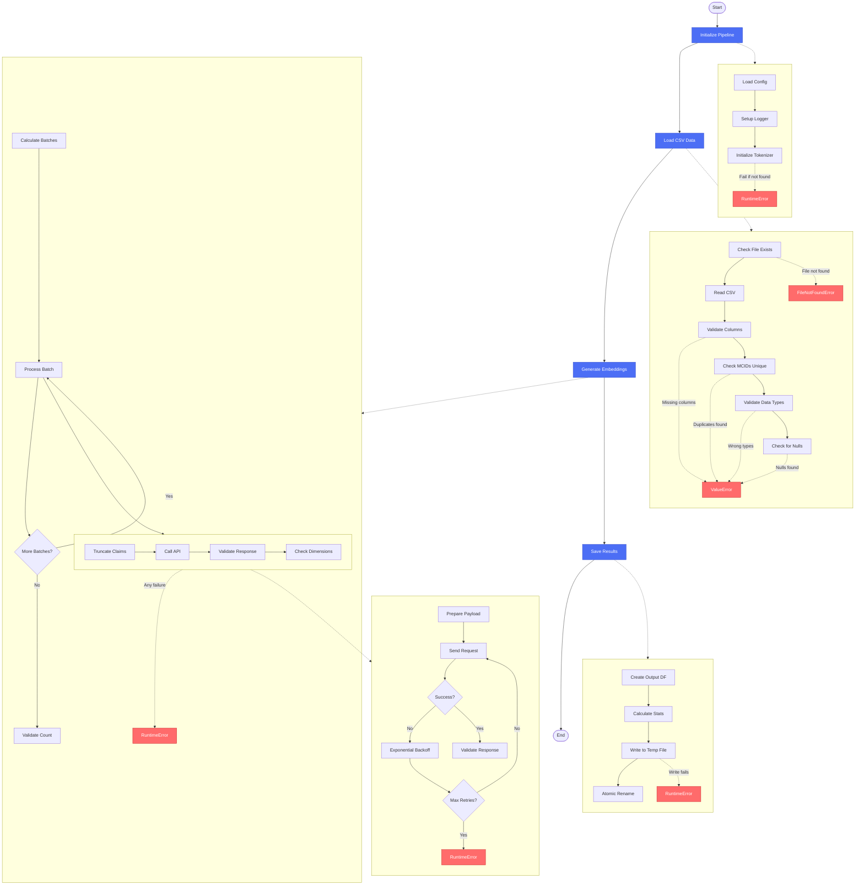

can you create a markdownfile with mermaid chart... Give higher level over view and for lowerlevel use subgraphs


# Embedding Pipeline Architecture
## Overview

The MediClaimGPT Embedding Pipeline is a fail-fast system for generating embeddings from CSV data using a tokenizer and API endpoint. It follows strict validation principles with no compromise on data quality.

## Architecture Diagram



## Component Details

### 1. Pipeline Initialization
- **Config Loading**: Loads PipelineConfig with all settings
- **Logger Setup**: Initializes structured logging
- **Tokenizer**: REQUIRED - fails fast if tokenizer cannot be loaded

### 2. Data Loading & Validation
**Required Columns**:
- `claims`: Text data (must be strings)
- `mcid`: Unique identifiers (integers or strings)
- `label`: Labels for the data

**Validation Steps**:
1. File existence and CSV format check
2. Column presence validation
3. MCID uniqueness enforcement
4. Data type validation
5. Null value rejection

### 3. Embedding Generation
**Process Flow**:
1. Batch calculation based on config batch size
2. Optional text truncation using tokenizer
3. API calls with exponential backoff retry
4. Strict validation of each embedding:
   - Non-empty
   - Correct data type (list of floats)
   - No NaN or infinity values
   - No zero vectors
   - Consistent dimensions

**API Integration**:
- Configurable endpoint
- Timeout increases with retries
- Jittered exponential backoff
- Comprehensive error handling

### 4. Results Storage
**Output Format**: CSV with columns:
- `mcid`: Original identifiers
- `label`: Original labels
- `embedding`: JSON-serialized embedding vectors

**Safety Features**:
- Atomic writes using temp files
- Parent directory creation
- Final validation before save

## Key Design Principles

1. **Fail-Fast Philosophy**: Any error stops the entire pipeline
2. **No Placeholders**: No zero embeddings or missing data
3. **Strict Validation**: Every step validates data integrity
4. **Required Tokenizer**: No character-based fallbacks
5. **All-or-Nothing**: Complete success or complete failure

## Error Handling

| Error Type | Cause | Impact |
|------------|-------|---------|
| FileNotFoundError | Missing input CSV | Pipeline stops |
| ValueError | Data validation failure | Pipeline stops |
| RuntimeError | Tokenizer/API/Save failure | Pipeline stops |

## Configuration Requirements

The pipeline requires a `PipelineConfig` object with:
- `embedding_generation.tokenizer_path`: Path to tokenizer (REQUIRED)
- `embedding_generation.batch_size`: Batch size for processing
- `model_api.base_url`: API endpoint base URL
- `model_api.endpoints['embeddings_batch']`: Batch endpoint path
- `model_api.timeout`: Request timeout
- `model_api.max_retries`: Retry attempts
- `data_processing.max_sequence_length`: Optional truncation length
- `logging`: Logging configuration

## Usage

```python
from models.config_models import PipelineConfig
from embedding_pipeline import EmbeddingPipeline

# Load configuration
config = PipelineConfig(...)

# Initialize pipeline
pipeline = EmbeddingPipeline(config)

# Run pipeline
results = pipeline.run(
    dataset_path="input.csv",
    output_path="output.csv",
    model_endpoint="https://api.example.com"  # Optional override
)
```

## Output Statistics

The pipeline calculates and returns:
- Mean, standard deviation, min, and max embedding norms
- Embedding dimensionality
- Processing timestamp
- Number of samples processed